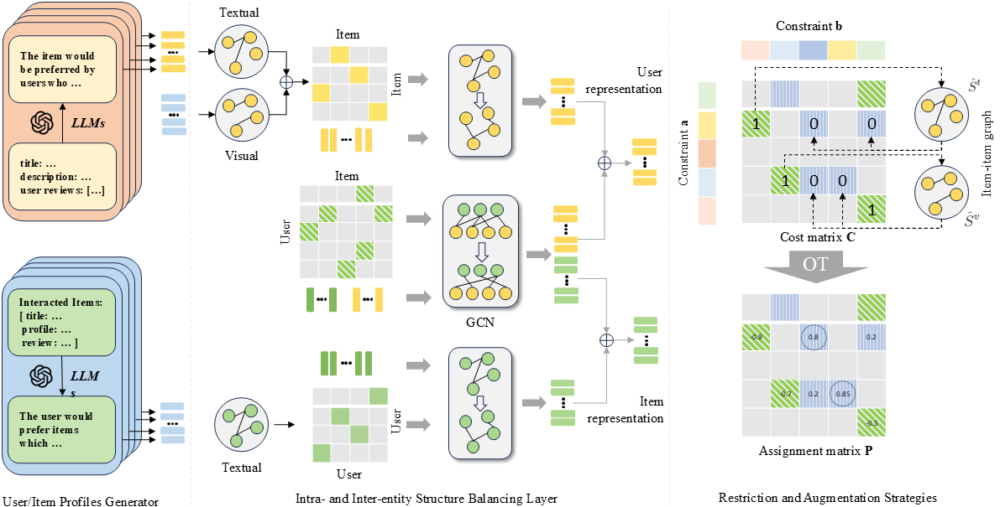

# BLAST
Pytorch implementation for "Balancing User-Item Structure and Interaction with Large Language Models and Optimal Transport for Multimodal Recommendation".

- :twisted_rightwards_arrows: This model is integrated into the [MMRec](https://github.com/enoche/MMRec) framework.
- This code references the [FREEDOM](https://github.com/enoche/FREEDOM).

Our main changes are in the following files:
1. Intra- and Inter-entity Structure Balancing module  -> src/models/blast.py
2. OT -> src/utils/modify.py
3. User/Item Profiles Generator -> preprocessing

OT Augmentation and Profile Generation will be uploaded soon.
## Overview of BLAST

## Data  
Download from Google Drive: [Baby/Sports/Clothing/etc.](https://drive.google.com/drive/folders/13cBy1EA_saTUuXxVllKgtfci2A09jyaG?usp=sharing)  
The data already contains text and image features extracted from Sentence-Transformers and CNN.  

## How to run
1. Put your downloaded data (e.g. `baby`) under `data` dir.
2. Enter `src` folder and run with  
`python main.py -m BLAST -d baby`  
You may specify other parameters in CMD or config with `configs/model/*.yaml` and `configs/dataset/*.yaml`.

---
No commercial use. License reserved by authors.
